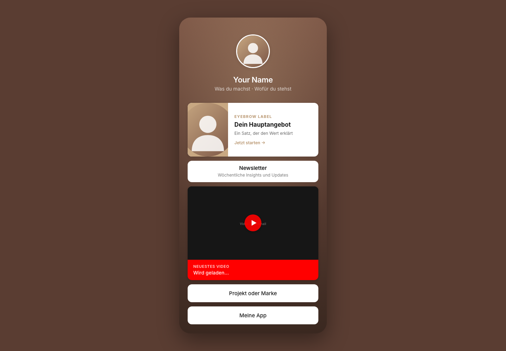
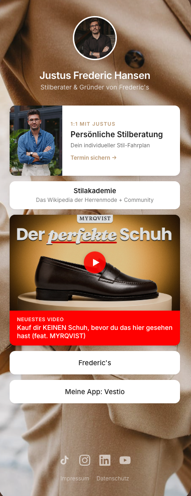
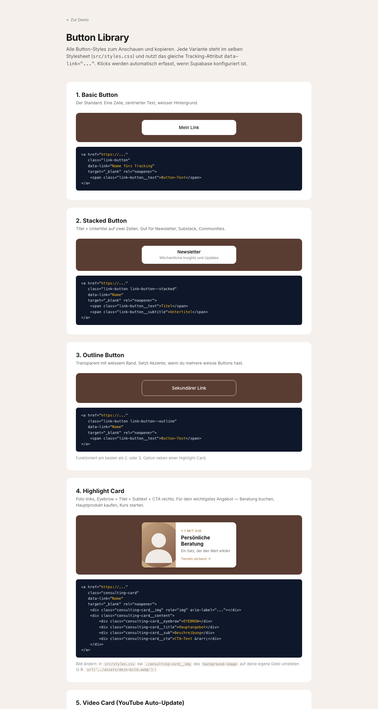

# Open Link Tree

Self-hosted Linktree-Alternative mit **eingebautem Tracking**, **schönem Design** und **Agent-First Setup**.

Statisches Frontend (HTML + CSS + JS, kein Build), eigenes Analytics-Dashboard, optionales YouTube-Auto-Update für's neueste Video. Hosting auf Netlify, Vercel, Cloudflare Pages oder wo du sonst willst.

<p align="center">
  
</p>
<p align="center"><sub>Default-Demo direkt nach <code>git clone</code></sub></p>

<p align="center">
  
</p>
<p align="center"><sub>Live in der Wildbahn — eigene Inhalte, eigene Marke, gleiche Codebase</sub></p>

```
links.deinedomain.com   ──▶  Open Link Tree (Frontend)
                              │
                              ├──▶  Supabase  ──▶  Dashboard (du)
                              └──▶  YouTube API (optional, server-side cached)
```

---

## Was das von anderen Open-Source-Linktrees unterscheidet

- **Eingebautes Backend-Tracking.** Klicks und Views landen in deiner eigenen Supabase-DB. Cookieless, DSGVO-freundlich, kein Banner-Pflicht. Andere OSS-Linktrees haben das nicht.
- **Mitgeliefertes Dashboard.** KPIs, Activity Chart, Top Links, Länder, Devices. Eigenes Repo nicht nötig.
- **YouTube Auto-Update.** Video-Card zeigt automatisch dein neuestes Longform-Video. Server-side gecached, Quota-safe.
- **Schönes Design.** Phone-Frame Look auf Desktop, Fullscreen auf Mobile. Highlight-Cards mit Bild + CTA, Stacked Buttons, Outline Buttons, Product Cards. Komplette Library in [`components.html`](components.html).
- **Agent-First.** Jede Datei dokumentiert sich selbst. Setup-Guides in `docs/`. `AGENTS.md` als Master-Brief für Claude/Cursor — du kopierst eine Anleitung, KI baut alles drumherum.

---

## Quick Start (5 Minuten — ohne Tracking, nur das Frontend)

```bash
git clone https://github.com/senorkaya/open-link-tree.git
cd open-link-tree
# Beliebigen statischen Server starten:
python3 -m http.server 8000
# Oder:  npx serve .
```

Öffne `http://localhost:8000` — du siehst die Demo. Editiere `index.html`, um deine Links einzutragen.

Deploy auf Netlify:
```bash
# Wenn du Netlify CLI hast:
npm i -g netlify-cli
netlify deploy --prod
```

Oder einfach das Repo in Netlify/Vercel/Cloudflare Pages connecten — kein Build-Step nötig, publish dir ist Root.

---

## Button-Style Library

Sechs vorgefertigte Button-Varianten in einem Stylesheet — Basic, Stacked, Outline, Highlight-Card, Video-Card und Product-Card. Du kombinierst sie frei, jede Variante wird auto-getrackt. Alle Snippets + Live-Vorschau in [`components.html`](components.html) (oder unter `/components.html` deployt).

<p align="center">
  <a href="components.html"></a>
</p>

---

## Setup mit Tracking + Dashboard (20-30 Minuten)

Schritt-für-Schritt-Guides in `docs/`:

1. [`01-setup-supabase.md`](docs/01-setup-supabase.md) — Supabase Projekt erstellen, Tabelle + RLS-Policies anlegen
2. [`02-setup-youtube.md`](docs/02-setup-youtube.md) — YouTube Data API Key holen und konfigurieren (optional, nur für Video-Card)
3. [`03-setup-tracking.md`](docs/03-setup-tracking.md) — Tracking aktivieren via Meta-Tags
4. [`04-button-styles.md`](docs/04-button-styles.md) — Alle Button-Varianten + wann was passt
5. [`05-deploy-netlify.md`](docs/05-deploy-netlify.md) — Frontend + Dashboard auf Netlify
6. [`06-deploy-elsewhere.md`](docs/06-deploy-elsewhere.md) — Vercel, Cloudflare Pages, GitHub Pages

Wenn du mit Claude / Cursor / einem AI-Agent arbeitest: gib der KI [`AGENTS.md`](AGENTS.md) als Kontext, sie kennt dann das gesamte Projekt-Setup.

---

## Repo-Struktur

```
open-link-tree/
├── README.md
├── AGENTS.md                       ← Master-Brief für AI-Coding-Tools
├── LICENSE                         ← MIT
├── index.html                      ← Deine Linktree-Seite
├── components.html                 ← Button-Style Library (Live-Demo)
├── netlify.toml                    ← Security Headers + CSP
├── src/
│   ├── styles.css                  ← Alle Button-Styles (eine Datei)
│   ├── tracking.js                 ← Klick + View Tracking nach Supabase
│   └── youtube.js                  ← Video-Card Auto-Update (optional)
├── assets/
│   ├── avatar-placeholder.svg
│   ├── background-placeholder.svg
│   └── video-placeholder.svg
├── netlify/
│   ├── edge-functions/geo.js       ← Country-Lookup über Netlify-Geo
│   └── functions/latest-video.js   ← YouTube-API-Proxy (server-side)
├── dashboard/
│   ├── index.html                  ← Analytics Dashboard
│   ├── styles.css
│   ├── dashboard.js
│   ├── netlify.toml
│   └── netlify/functions/events.js ← Supabase-Proxy (Secret Key)
└── docs/                           ← Setup-Guides (auf Deutsch)
```

---

## Tech-Stack

- **Frontend:** Pure HTML / CSS / JS — kein React, kein Build, kein npm.
- **Tracking:** [Supabase](https://supabase.com) (kostenlos bis 500 MB DB + 5 GB Egress / Monat).
- **Charts:** [Chart.js](https://www.chartjs.org/) via CDN — nur im Dashboard.
- **Hosting:** Netlify empfohlen wegen Edge Functions für Geo-Lookup. Funktioniert aber auch auf Vercel, Cloudflare Pages, GitHub Pages (ohne Tracking-Country) — Details in `docs/06`.

---

## Privacy / DSGVO

Das Tracking ist bewusst minimal:

- **Keine Cookies** — kein Banner nötig.
- **Keine IP-Speicherung** — Country wird von der Netlify Edge Function berechnet, IP nie an die DB gesendet.
- **Kein User-Agent**, nur "mobile" oder "desktop".
- **Keine eindeutige Besucher-ID**, keine Cross-Site-Tracker.

Was gespeichert wird: `event_type`, `link_name`, `channel`, `country`, `referrer`, `device`, `utm_source`, `created_at`.

In Deutschland/EU brauchst du dafür kein Consent-Banner (cookieless + anonym). Bitte aber trotzdem in deiner Datenschutzerklärung erwähnen, dass du eigenes Analytics nutzt.

---

## Security

- Content-Security-Policy in `netlify.toml` setzt strict defaults
- Supabase Anon Key hat nur INSERT-Recht auf `link_events` (siehe `docs/01`)
- Dashboard liest via Netlify Function mit Secret Key (nie im Browser)
- YouTube API Key bleibt server-side via Netlify Function
- Empfehlung: Dashboard mit Netlify Password-Protection oder Identity absichern

---

## Lizenz

MIT — see [LICENSE](LICENSE).

Erstellt von [Digital Marketing Titans](https://digitalmarketingtitans.com). Fork, fork, fork — gern auch PRs.
